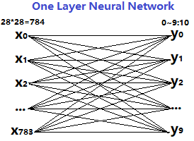

# Source Code Reading

## one layer neural network recognize handwriten digits
* datasets MNIST
* Please check the README_initial.md to obtain the initial GitHub Code
* neural network 
*


* lost function & accuracy
*


* directory tree
```
.
├── 1layer-neural-network.png
├── data
│   ├── t10k-images-idx3-ubyte
│   ├── t10k-labels-idx1-ubyte
│   ├── train-images-idx3-ubyte
│   └── train-labels-idx1-ubyte
├── filetree.md
├── include
│   ├── mnist_file.h
│   └── neural_network.h
├── loss+accuracy.jpg
├── Makefile
├── mnist.c
├── mnist.exe
├── mnist_file.c
├── neural_network.c
├── README.md
├── README_initial.md
└── tmp.txt

2 directories, 17 files
```
